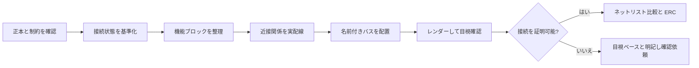

<div align="center">


# Schematic Humanizer

**ラベルとネットリスト頼みの回路図を、人がレビューできる設計資料へ。**

[](https://github.com/keitark/schematic-humanizer/actions/workflows/validate.yml)
[](LICENSE)
[](docs/adapters.ja.md#kicad)
[](docs/adapters.ja.md)
[](README.md)
[](README.ja.md)

[English](README.md) · [インストール](docs/installation.ja.md) · [アダプター](docs/adapters.ja.md) · [サポート](SUPPORT.ja.md)

</div>

Schematic Humanizer は、読みにくい電子回路図を、人が理解・レビューしやすい資料へ整理するための Codex スキルです。近くの部品は実配線でつなぎ、繰り返し信号は名前付きバスにまとめ、機能単位でシートを分け、自然な信号の流れと十分な余白を作ります。

これはオートルーターでも、ネットリストから見栄えだけを作るツールでも、電気設計の合格証でもありません。見やすさの修正と回路変更を明確に分離し、入力形式に応じた検証証拠を要求します。

## 改善する問題

- 電気的には接続されているのに、見た目では関係が分からない近接部品
- 孤立したネットラベルばかりで構成されたページ
- シンボル、文字、無関係な機能ブロックを横切るバス
- USB、リセット、電源、クロック、グルーロジックが浮いて見える回路
- 機能別シートへ分割すべき巨大な 1 ページ回路図
- 生成済み回路図ではなくジェネレーターが正本となっているプロジェクト

重要な信号経路を、レビュー担当者がネットリストから頭の中で復元しなくても追える状態を目指します。

## ワークフロー



このスキルはアダプテーション層を使います。レビュー手順は共通ですが、ソース編集、レンダリング、接続検証の方法は EDA 形式ごとに切り替えます。

| 入力 | 編集方法 | 接続検証の確度 |
|---|---|---|
| KiCad ソースまたはジェネレーター | ネイティブ形式／ジェネレーターを編集し、CLI でレンダー・検証 | エクスポート可能なら厳密比較 |
| Altium、EasyEDA、EAGLE/Fusion、gEDA/Lepton | ネイティブソース、API、交換形式を使用 | 信頼できる変更前後ネットリストがある場合のみ厳密 |
| SPICE／単体ネットリスト | 正本の接続情報からレビュー用図面を再構成 | 接続比較は可能。シンボルの意図は人による確認が必要 |
| PDF／画像のみ | 注釈、トレース、再作図計画を作成 | 目視ベース。**独立した厳密検証は不可** |

KiCad 以外で使う前に、[アダプターの対応範囲と制約](docs/adapters.ja.md)を確認してください。

## クイックインストール

リポジトリをクローンし、スキル本体をプロジェクト内または個人用 Codex スキルディレクトリへコピーします。

### プロジェクト単位

```text
your-project/
└── .agents/
    └── skills/
        └── schematic-humanizer/
            └── SKILL.md
```

### 個人用

`$CODEX_HOME/skills/schematic-humanizer` に配置します。`CODEX_HOME` が未設定なら `~/.codex/skills/schematic-humanizer` を使用します。

PowerShell と macOS/Linux 用の正確なコマンドは、[日本語インストールガイド](docs/installation.ja.md)にあります。[English guide](docs/installation.md) も利用できます。

## 使い方

Codex に次のように依頼します。

```text
$schematic-humanizer を使って、この回路図を人がレビューしやすい構成に
整理してください。電気的接続は維持し、正本を編集し、全シートをレンダーして、
変更前後の検証結果を提示してください。
```

PDF や画像しかない場合:

```text
$schematic-humanizer を使って、この回路図 PDF を分析してください。
厳密な接続検証ができたとは表現せず、機能別の再作図計画を作り、
不明または判読不能な接続をすべて明示してください。
```

## 安全ゲート

見やすさの修正が、知らないうちに回路設計変更へ変わることを防ぎます。

1. 編集前に正本を特定します。ジェネレーターが回路図を生成する場合はジェネレーターを編集します。
2. ツールが対応していれば、ネットリスト、ERC、シート画像、リポジトリ状態を変更前の基準として保存します。
3. 電気的変更が明示的に許可されていない限り、部品番号、ピン所属、ネット名、接続を維持します。
4. 近接した機能関係には実配線を使い、繰り返し信号にはバスを使います。装飾目的の配線は行いません。
5. 再生成・エクスポート後、ツールに適した方法で変更前後を比較します。
6. 全ページをページ全体と高密度部分の両方で目視確認します。
7. 電気的な懸念は別項目で報告します。読みやすい回路図が正しい回路とは限りません。
8. PDF／画像のみの結論には「目視ベース・未検証」と明記します。

## リポジトリ構成

```text
.agents/skills/schematic-humanizer/  Codex スキル本体
assets/                              公開用アートワーク
docs/                                インストール・アダプター資料
.github/                             CI と Issue フォーム
scripts/validate_repo.py             軽量リポジトリ検証
```

## コントリビューションとサポート

EDA アダプター、検証手順、目視レビュー基準の改善を歓迎します。Pull Request の前に [CONTRIBUTING.md](CONTRIBUTING.md) を確認してください。

使い方の質問や再現可能な問題は [SUPPORT.ja.md](SUPPORT.ja.md) を参照してください。英語版は [SUPPORT.md](SUPPORT.md) です。

## ライセンス

[MIT](LICENSE) © 2026 keitark
