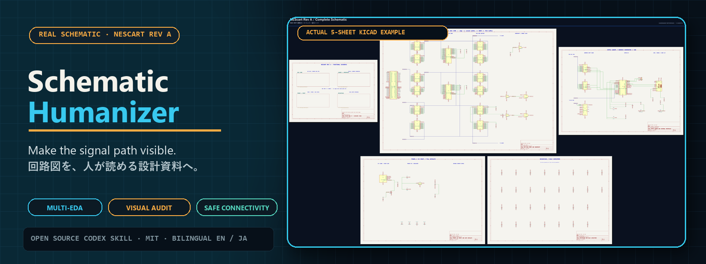
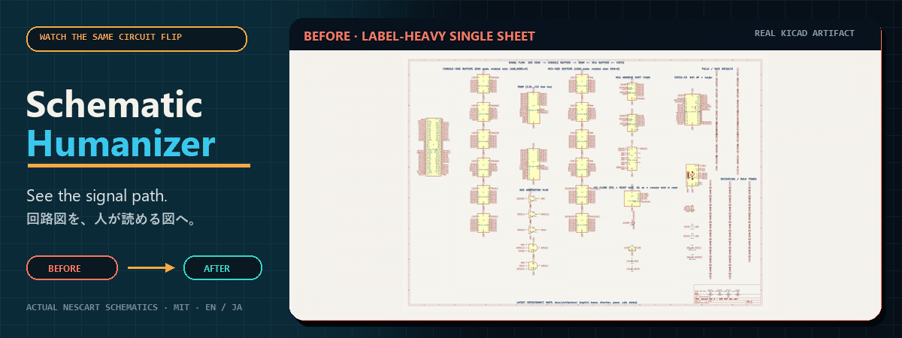

<div align="center">



# PCBA Design Skills

**Codex と Claude Code で使える、証拠と承認ゲートに基づく電子回路設計チーム。**

[](https://github.com/Keitark/pcba-design-skills/actions/workflows/validate.yml)
[](https://github.com/Keitark/pcba-design-skills/releases)
[](LICENSE)
[](ASSET-LICENSES.md)
[](#1-つのスキルでも全体でも利用可能)
[](docs/installation.ja.md)
[](README.md)
[](README.ja.md)

[English](README.md) · [スキルを選ぶ](docs/choose-a-skill.ja.md) · [インストール](docs/installation.ja.md) · [プロンプト例](docs/prompts.ja.md) · [nescart 事例](docs/case-study-nescart.ja.md)

</div>

PCBA Design Skills は、アイデア、回路説明、ネイティブ回路図、ネットリスト風
回路図、PCB、BOM、製造パッケージを、レビュー可能な設計成果物へ段階的に
変換します。必要な専門スキルだけを使うことも、マネージャーで設計から発注
レビューまでを連携することもできます。

「見やすい回路図＝正しい回路」「0 open＝製造可能」「アップロード成功＝
実装位置が正しい」とは判断しません。各段階を独立した証拠で検証します。

## 1 つのスキルでも全体でも利用可能

| スキル | 用途 | 主な成果物 |
|---|---|---|
| [`manage-pcba-program`](.agents/skills/manage-pcba-program/SKILL.md) | 全体調整、ゲート、無効化、承認管理 | `program-state.json` |
| [`plan-electronic-product`](.agents/skills/plan-electronic-product/SKILL.md) | 製品説明から要件と構成を整理 | `product-brief.yaml`, `architecture.md` |
| [`qualify-pcba-sourcing`](.agents/skills/qualify-pcba-sourcing/SKILL.md) | MPN、パッケージ、在庫、価格、CAD、代替品を確認 | `sourcing-lock.csv` |
| [`design-and-review-circuit`](.agents/skills/design-and-review-circuit/SKILL.md) | 電源、タイミング、状態、安全性、回路バグを監査 | `circuit-review.md` |
| [`schematic-humanizer`](.agents/skills/schematic-humanizer/SKILL.md) | 実配線、バス、機能シート、重なり除去、画像監査 | 読みやすい回路図、PDF/PNG、接続比較 |
| [`pcb-layout-review`](.agents/skills/pcb-layout-review/SKILL.md) | 部品配置、派生基板、配線、基準面、DRC、機構、DFM | `layout-review.json`, 実験台帳 |
| [`release-pcba-fabrication`](.agents/skills/release-pcba-fabrication/SKILL.md) | 同一リビジョンの Gerber、ドリル、BOM、CPL を作成 | `release-manifest.json` |
| [`operate-jlcpcb-order`](.agents/skills/operate-jlcpcb-order/SKILL.md) | JLCPCB 見積、部品割当、実装プレビュー、任意の現物ステンシル、費用、承認 | 配置・見積・発注記録 |

入力別の選び方と単独利用方法は[スキル選択ガイド](docs/choose-a-skill.ja.md)を
参照してください。

## 全体ワークフロー


連携成果物は既定で `.pcba-workflow/` に保存し、状態は `PASS`、`BLOCKED`、
`USER_REVIEW` のみを使います。ネットリスト、MPN/パッケージ、フットプリント、
配置、配線、BOM、CPL、ブラウザ上の配置変更は、影響する後続ゲートを無効化
します。詳細は[成果物契約](docs/artifact-contracts.ja.md)にあります。

## クイックインストール

Codex へ 1 スキルだけ導入する例:

```text
$skill-installer を使って、Keitark/pcba-design-skills の
.agents/skills/schematic-humanizer を v1.0.0 に固定して
schematic-humanizer としてインストールしてください。
```

8 スキル一括、個人用・プロジェクト用、Codex・Claude Code、PowerShell・
macOS/Linux のコマンドは[インストールガイド](docs/installation.ja.md)にあります。

## 使い始める

Codex:

```text
$manage-pcba-program を使って、回路説明、回路図/ネットリスト、PCB、BOM を
確認してください。プロジェクト状態を作成し、必要な専門スキルだけを実行し、
未解決の技術判断またはユーザー承認ゲートで停止してください。
```

Claude Code:

```text
/manage-pcba-program このプロジェクトを確認し、発注可能な製造リリースまで
必要な段階を調整してください。
```

個別スキルの日本語依頼文は[プロンプト例](docs/prompts.ja.md)にあります。

## 安全性と証拠

- 生成物だけでなく、正本またはジェネレーターを編集します。
- 接続を取得できる場合は `schematic-connectivity-v1` で変更前後を比較します。
- ERC/DRC だけで終わらず、全回路図ページ、高密度部、PCB 表裏、実装部品を目視確認します。
- 信号・電源の未説明な切断を実エラーとして扱います。pad open だけでは判定しません。
- データシート、メーカー指針、在庫、価格、製造能力は最新の一次情報を使います。
- CPL の回転・原点はソース側で修正し、再生成・再アップロードします。
- 重要部品の代替、実装配置、最終価格、支払いは別々に承認します。

## 実プロジェクトで得た知識

[nescart 事例](docs/case-study-nescart.ja.md)では、ネットリスト風 KiCad 回路図の
人間可読化、回路・アーキテクチャ監査、配置方針、4/6 層と GND/電源面の検討、
配線実験の採点、0 open と実 DRC/電源接続の分離、製造費を押し上げるビア、
CPL の X/Y・回転・pin 1 修正までを実物の画像で説明します。



## コントリビューション、サポート、ライセンス

Issue/PR の前に [CONTRIBUTING.ja.md](CONTRIBUTING.ja.md) を確認してください。
利用時に必要な証拠は [SUPPORT.ja.md](SUPPORT.ja.md) にあります。

コードと独自ドキュメントは [MIT](LICENSE)、nescart 由来の事例・バナー画像は
[CC BY-SA 4.0（帰属表示付き）](ASSET-LICENSES.md)です。
