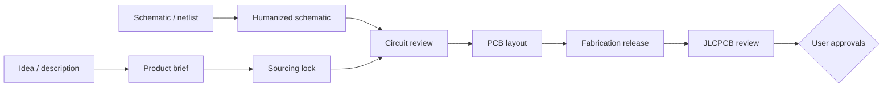

<div align="center">


# PCBA Design Skills

**A modular, evidence-gated electronics design team for Codex and Claude Code.**

[](https://github.com/Keitark/pcba-design-skills/actions/workflows/validate.yml)
[](https://github.com/Keitark/pcba-design-skills/releases)
[](LICENSE)
[](ASSET-LICENSES.md)
[](#choose-one-skill-or-the-whole-team)
[](docs/installation.md)
[](README.md)
[](README.ja.md)

[日本語](README.ja.md) · [Choose a skill](docs/choose-a-skill.md) · [Install](docs/installation.md) · [Prompts](docs/prompts.md) · [nescart case study](docs/case-study-nescart.md)

</div>

PCBA Design Skills turns an idea, circuit description, native schematic,
netlist-like drawing, PCB, BOM, or fabrication package into a sequence of
reviewable engineering artifacts. Use one specialist for a focused job or the
manager for the complete design-to-order workflow.

The suite does not confuse a clean drawing with a correct circuit, zero opens
with a releasable PCB, or a successful upload with correct assembly placement.
Every stage has explicit evidence and invalidation rules.

## Choose one skill or the whole team

| Skill | Use it for | Main artifact |
|---|---|---|
| [`manage-pcba-program`](.agents/skills/manage-pcba-program/SKILL.md) | End-to-end coordination and gate tracking | `program-state.json` |
| [`plan-electronic-product`](.agents/skills/plan-electronic-product/SKILL.md) | Turning behavior and constraints into engineering inputs | `product-brief.yaml`, `architecture.md` |
| [`qualify-pcba-sourcing`](.agents/skills/qualify-pcba-sourcing/SKILL.md) | Exact MPN, package, stock, cost, CAD, and substitution review | `sourcing-lock.csv` |
| [`design-and-review-circuit`](.agents/skills/design-and-review-circuit/SKILL.md) | Circuit correctness, power, timing, states, protection, and constraints | `circuit-review.md` |
| [`schematic-humanizer`](.agents/skills/schematic-humanizer/SKILL.md) | Visible wiring, buses, functional sheets, overlap removal, and visual QA | readable source, PDF/PNG, connectivity comparison |
| [`pcb-layout-review`](.agents/skills/pcb-layout-review/SKILL.md) | Placement, derivative variants, routing, references, planes, DRC, mechanics, and DFM | `layout-review.json`, experiment ledger |
| [`release-pcba-fabrication`](.agents/skills/release-pcba-fabrication/SKILL.md) | Revision-consistent Gerber, drill, BOM, CPL, and release evidence | `release-manifest.json` |
| [`operate-jlcpcb-order`](.agents/skills/operate-jlcpcb-order/SKILL.md) | JLCPCB quote, matching, CPL preview, optional physical stencil, cost, cart, and approval gates | placement/quote/order records |

[The selection guide](docs/choose-a-skill.md) includes input-based examples and
shows which skills can be used without the manager.

## Workflow



All interoperable artifacts default to `.pcba-workflow/` and use `PASS`,
`BLOCKED`, or `USER_REVIEW`. A changed netlist, MPN/package, footprint,
placement, routing, BOM, CPL, or browser placement invalidates its downstream
gates; see [artifact contracts](docs/artifact-contracts.md).

## Quick install

Ask Codex to install one skill:

```text
Use $skill-installer to install schematic-humanizer from
Keitark/pcba-design-skills at
.agents/skills/schematic-humanizer, pinned to v1.0.0.
```

Or install the complete team using the commands in the
[installation guide](docs/installation.md). The guide covers personal and
project-local installation for both Codex and Claude Code, PowerShell and
macOS/Linux, updates, removal, and verification.

## Start a workflow

Codex:

```text
Use $manage-pcba-program to inspect the available circuit description,
schematic/netlist, PCB, and BOM. Create the project state, run only the required
specialists, and stop at every unresolved engineering or user-approval gate.
```

Claude Code:

```text
/manage-pcba-program inspect this project and coordinate the required stages
through an order-ready manufacturing release.
```

For focused requests and Japanese examples, use the
[copy-paste prompt guide](docs/prompts.md).

## Safety and evidence

- Edit the authoritative source or generator, not only its output.
- Preserve and compare `schematic-connectivity-v1` when exact connectivity is
  available; label PDF/image-only conclusions visually guided.
- Render and inspect every schematic sheet, dense region, PCB side, and critical
  placement. ERC/DRC cannot replace visual review.
- Treat every unexplained signal or power disconnect as real. Zero pad opens is
  not a release gate by itself.
- Use current primary sources for datasheets, manufacturer guidance, stock,
  pricing, and fabrication capabilities.
- Correct CPL rotation/origin errors in the source mapping, regenerate hashes,
  and re-upload. Browser-only fixes are never manufacturing evidence.
- Keep design-critical substitution, assembly placement, final price, and
  payment approvals separate.

## Real project evidence

The [nescart case study](docs/case-study-nescart.md) records the workflow that
formed these skills: netlist-shaped KiCad pages became visibly wired functional
schematics; architecture informed placement; layer/plane choices and routing
experiments were measured; zero opens was checked against real DRC and power
connectivity; fabrication cost feedback changed via strategy; and every CPL
offset/rotation was corrected and visually rechecked.


## Contributing, support, and license

Read [CONTRIBUTING.md](CONTRIBUTING.md) before opening an issue or pull request.
Usage and evidence requirements are in [SUPPORT.md](SUPPORT.md).

Code and original documentation are [MIT](LICENSE). Real nescart-derived
case-study and banner assets are [CC BY-SA 4.0 with attribution](ASSET-LICENSES.md).
