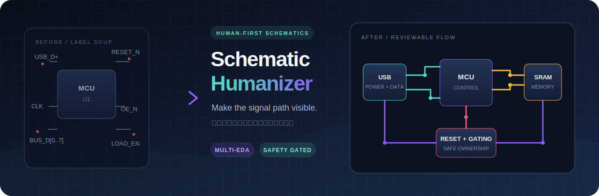
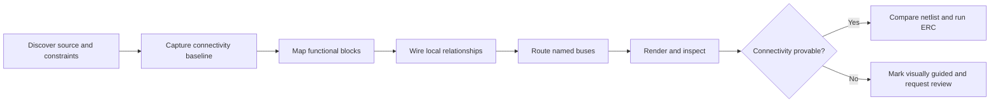

<div align="center">



# Schematic Humanizer

**Turn label soup and netlist-shaped schematics into diagrams people can review.**

[](https://github.com/keitark/schematic-humanizer/actions/workflows/validate.yml)
[](LICENSE)
[](docs/adapters.md#kicad)
[](docs/adapters.md)
[](README.md)
[](README.ja.md)

[日本語](README.ja.md) · [Installation](docs/installation.md) · [Adapters](docs/adapters.md) · [Support](SUPPORT.md)

</div>

Schematic Humanizer is a Codex skill for reorganizing difficult electronic schematics into human-readable engineering documents. It prefers direct wires for nearby functional relationships, named buses for repeated signals, functional hierarchy, consistent flow, and enough whitespace to make review practical.

It is **not** an autorouter, a netlist-to-art generator, or an electrical-approval stamp. The skill separates presentation corrections from circuit changes and requires evidence appropriate to the source format.

## What it fixes

- Nearby parts that are electrically connected but look visually unrelated
- Pages dominated by isolated net labels
- Buses crossing symbols, text, or unrelated functional blocks
- USB, reset, power, clock, and glue logic that visually appears to float
- One-page schematics that should be split into functional sheets
- Generated schematics where the generator—not the rendered file—is the source of truth

The goal is a reviewer-friendly schematic whose important signal paths are visible without mentally reconstructing the netlist.

## The workflow



The skill uses an adaptation layer: the review method stays consistent while source editing, rendering, and connectivity checks change with the EDA format.

| Input | Edit path | Connectivity confidence |
|---|---|---|
| KiCad source or generator | First-class native/generator edit, CLI render and checks | Exact comparison when exportable |
| Altium, EasyEDA, EAGLE/Fusion, gEDA/Lepton | Native source, automation API, or exported interchange files | Exact only when a trustworthy before/after netlist is available |
| SPICE or standalone netlist | Reconstruct a review diagram from authoritative connectivity | Connectivity can be compared; symbol intent still needs review |
| PDF or image only | Annotate, trace, and propose a redraw plan | Visually guided; **not independently verifiable** |

See [adapter capabilities and limitations](docs/adapters.md) before using a non-KiCad workflow.

## Quick install

Clone the repository, then copy the skill package to either your project or your personal Codex skills directory.

### Project-local

```text
your-project/
└── .agents/
    └── skills/
        └── schematic-humanizer/
            └── SKILL.md
```

### Personal

Install to `$CODEX_HOME/skills/schematic-humanizer`, or `~/.codex/skills/schematic-humanizer` when `CODEX_HOME` is not set.

Exact PowerShell and shell commands are in the [English installation guide](docs/installation.md) and [Japanese installation guide](docs/installation.ja.md).

## Use it

Ask Codex directly:

```text
Use $schematic-humanizer to reorganize this schematic for human review.
Preserve electrical connectivity, edit the real source of truth, render every
sheet, and show me the before/after validation evidence.
```

For a visual-only source:

```text
Use $schematic-humanizer to analyze these schematic PDFs. Do not claim exact
connectivity validation. Produce a functional redraw plan and clearly mark
every uncertain or unreadable connection.
```

## Safety gates

The skill is designed to stop presentation work from silently becoming a circuit redesign.

1. Identify the authoritative source before editing. If a generator owns the schematic, edit the generator.
2. Capture a baseline netlist, ERC result, sheet render, and repository status when the tool supports them.
3. Preserve component references, pin membership, net names, and connectivity unless the user explicitly authorizes an electrical change.
4. Use direct wires for local relationships and buses for repeated related signals—not as decoration.
5. Regenerate, export, and compare with tool-appropriate checks.
6. Inspect every rendered page at full-page scale and around dense areas.
7. Report electrical concerns separately. A readable schematic is not necessarily a correct circuit.
8. Label PDF/image-only conclusions as visually guided and unverified.

## Repository layout

```text
.agents/skills/schematic-humanizer/  Codex skill package
assets/                              Public artwork
docs/                                Installation and adapter guides
.github/                             Validation workflow and issue forms
scripts/validate_repo.py             Lightweight repository validator
```

## Contributing and support

Contributions for additional EDA adapters, validation recipes, and better visual-review heuristics are welcome. Read [CONTRIBUTING.md](CONTRIBUTING.md) before opening a pull request.

For usage questions or a reproducible problem, see [SUPPORT.md](SUPPORT.md). Japanese help is available in [SUPPORT.ja.md](SUPPORT.ja.md).

## License

[MIT](LICENSE) © 2026 keitark
