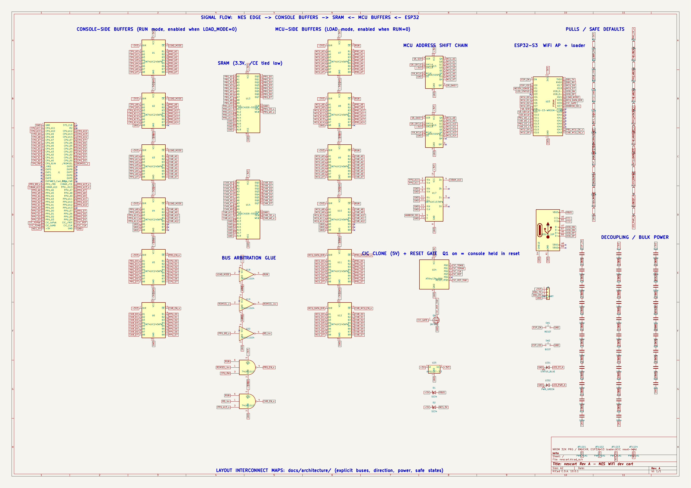
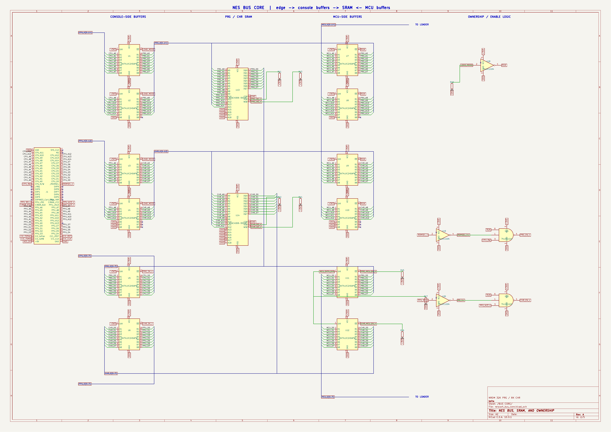
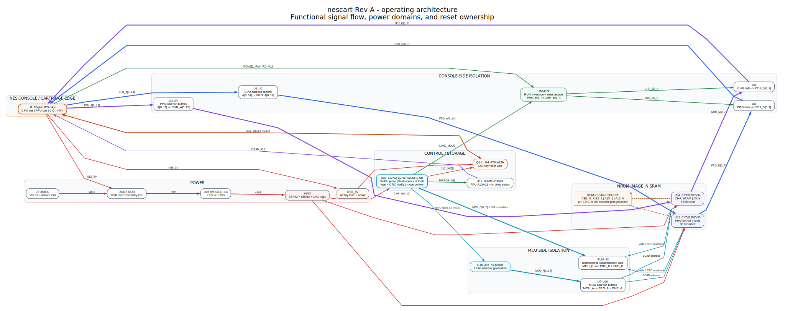
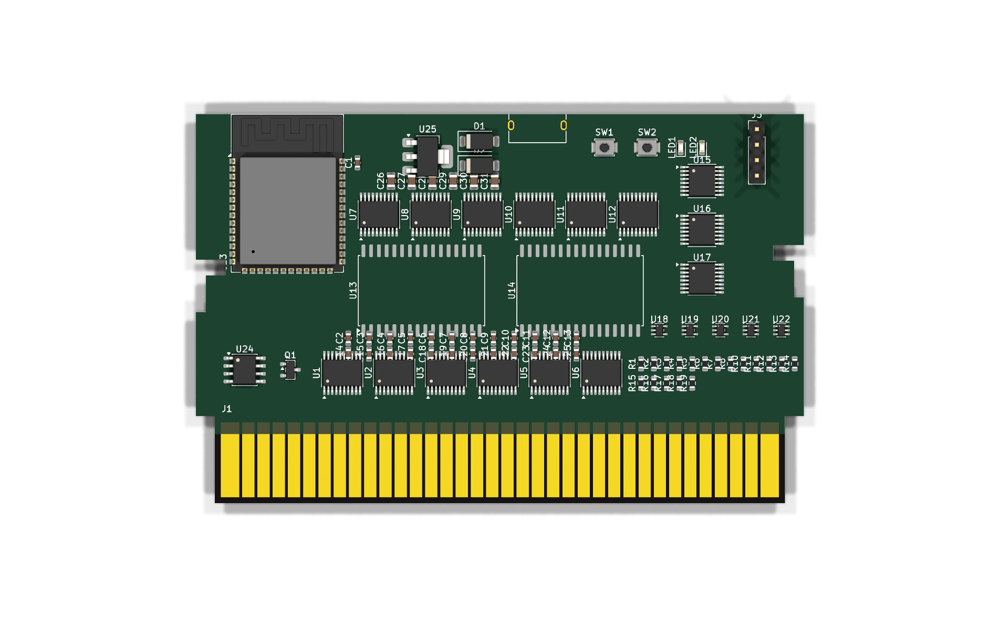
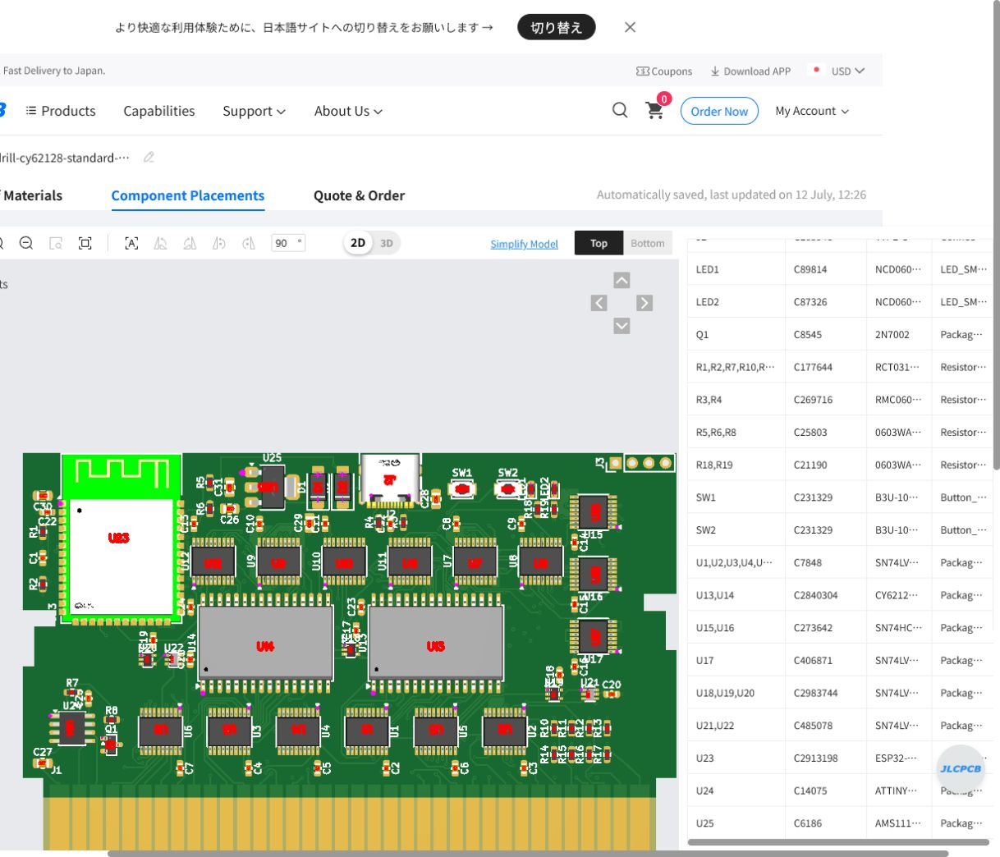

# 事例: nescart Rev A

[English](case-study-nescart.md) · [README に戻る](../README.ja.md)

nescart はフロントローディング NES 用 WiFi 開発カートリッジです。ESP32-S3 が
homebrew ROM を受信し、CIC 動作で本体を reset 保持しながら SRAM へロード・
検証し、reset を解除すると NES が SRAM をカートリッジとして読みます。この
実プロジェクトが 8 スキルの証拠になりました。

> 以下の値や層構成は 1 枚の実例であり、全 PCB の既定値ではありません。

## 1. ネットリスト風ページを追跡可能な回路図へ

元のページは孤立ラベルに依存し、コネクタ、ESP32、USB、SRAM、バッファ、
グルーロジック、reset、pull、電源が見た目では関係なく浮いていました。

| Before | Humanized |
|---|---|
|  |  |

機能別シート、近接部品の実配線、本物のバス、左から右の流れ、コネクタ方向、
余白を導入しました。全ページと高密度部を画像確認し、部品下を通るバスも修正。
接続比較は目視と別に実施し、見やすさを回路合格とは扱いませんでした。

## 2. 回路・アーキテクチャ監査

全部品の役割、ROM load 手順、バス所有権、安全な hardware default、電源、
reset gate、memory control、WiFi 転送と USB service/flash の役割差を文書化。
速度、電流、基準面、長さ差、アンテナ、メーカー資料を `[SPEC]`、`[TARGET]`、
`[TBD-MEASURE]` に分けました。

部品番号順や単一 HPWL ではなく、この図を console buffer → SRAM → MCU buffer、
loader、電源/USB、CIC/reset の配置方針にしました。

## 3. 配置、層、配線、正直な完成判定

4/6 層、電源面、信号層数、return path、費用を比較しました。バスが極端な高速
でなく、ESP32 が module でも連続 GND reference は重要でした。最終リリースは
根拠のある 6 層ですが、スキルは他基板へ 6 層を固定しません。

各配線実験で opens、実 DRC、電源切断、layout check、製造欠陥、再現性を記録。
改善は加点、timeout/no-change は減点、物理悪化は接続改善より強く減点しました。
0 open でも多数の clearance error を作った候補を不合格にし、同一保存状態で
raw disconnect 0、real DRC 0、signal split 0、power disconnect 0、layout fail 0
を要求しました。

## 4. 製造費と部品調達のフィードバック

実見積で小径 mechanical drill が高価な工程を発動。全ビアを乱暴に変更せず、
全層 clearance を確認できた場所だけ標準化し、接続、DRC、plane、drill、Gerber、
manifest、再見積を繰り返しました。

memory の調達とパッケージ情報も発注直前に問題化したため、今後は MPN、pin、
package drawing、footprint、CAD/3D、在庫、総費用を配置固定前に lock します。

## 5. CPL の位置・回転・物理 pad

実装プレビューで SRAM、logic、ESP32 module、regulator の X/Y と回転解釈を確認。
同じ電気 pad 番号を持つ端子、tab、supplier alias を平均せず、物理 instance 単位
で比較する必要が分かりました。ブラウザ変更は診断だけに使い、CPL source へ
反映、hash、再 upload、全配置目視確認を繰り返しました。

最終 import は全実装 reference を照合し、部品、配置、最終価格、支払いを別々に
承認しました。PCB 5 枚、PCBA 3 枚の cart を準備しましたが、支払い承認とは
扱いませんでした。

## ライセンス

実際の nescart 由来画像・図は CC BY-SA 4.0 です。
[帰属表示](../ASSET-LICENSES.md)を参照してください。コードと独自スキル文書は MIT です。
